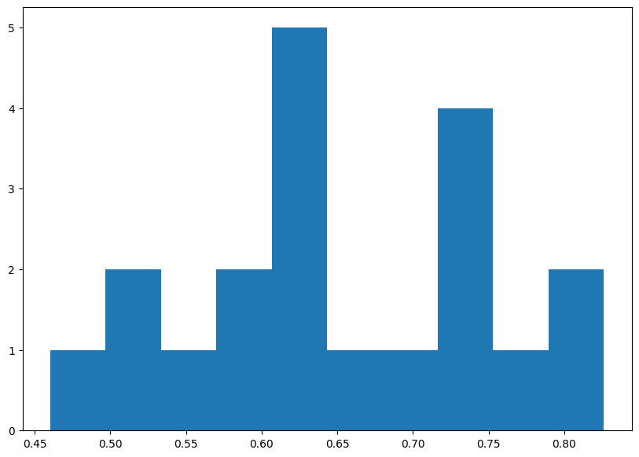

# ArxivAgent

## LLM-ассистент для исследователя

ArxivAgent - это интеллектуальный ассистент на базе LLM, который способен помочь ученому в исследовании любой области на основе статей на arxiv.org. Ассистент изучает выбранную отрасль на основе поданных ключевых слов и собирает обработанные знания в кратком дайджесте по ключевым направлениям исследований в данном направлении.

### Цели проекта
- Ускорить процесс изучения главных трендов в какой-либо отрасли
- Упростить поиск релевантных статей
- Обобщать материал статьи для понимания главных идей и целей

### Ключевые функции
1. **Поиск статей по ключевым словам**
   - Получение статей в формате PDF
   - Получение статей, на которые ссылаются эти статьи (WIP)

2. **Выполнение суммаризации по найденным статьям**
   - Создание краткого дайджеста на основе найденных статей
   - Выделение ключевых технологий/трендов по отрасли

3. **Модуль рерайтера запросов (WIP)**
   - Изменение текста запроса для расширения окна поиска статей
   - Корректировка ошибок и опечаток в запросе
   
### Технологии
- Основная LLM: qwen2.5:7b-instruct
- Фреймворк: langchain, ollama
- База данных: Arxiv.org
- Фронтенд: Streamlit
  
### Начало работы
```bash
git clone https://github.com/echanatwell/ArxivAgent.git
cd ArxivAgent
pip install -r requirements.txt
streamlit run main.py
```
### Установка Ollama
Для работы с проектом необходимо установить ollama - ПО для локального развертывания и использования больших языковых моделей. 
Для установки потребуется:
1. Установить ollama на свой ПК (https://ollama.com/)
2. Загрузить веса LLM для работы. В данном проекте используется **qwen2.5:7b-instruct**
```bash
ollama pull qwen2.5:7b-instruct
```
3. Обычно после этого все готово к работе. Иногда ollama требует отдельного запуска в этом случае необходимо самостоятельно прописать `ollama serve`
### Валидация
Оценка качества работы агента с помощью прямых запросов к нему представляла бы некоторую сложность, поскольку при запросе агент может выдавать недетерменированный ответ, находя разные статьи на Arxiv.org от запуска к запуску. В связи с этим была собрана выборка статей, их Related Work в качестве таргет и ссылок, относящихся к тексту в этом параграфе. Тул поиска статей на Arxiv.org был переписан для случая валидации агента, чтобы извлекать статьи из локальной директории.

Полученная агентом суммаризация и целевой текст кодировались в вектор с помщью SenteceTransformer, и затем векторы сравнивались по метрике расстояния (L2). В результате распределение схожести текстов получилось следующее:



Была выбрана граница, равная 0.6 - если схожесть текстов была выше этой границы, то считалось, что агент справился с суммаризацией контента. На основе этой границы была посчитана доля успешных суммаризаций (по сути Accuracy) - 75.00%.
### Контакты

**Авторы проекта:** [Матвей Колтунов](https://github.com/echanatwell), [Орхан Казымов](https://github.com/RaySkarken), [Кожевников Александр Юрьевич]()

**Email:** koltunov.matwei@gmail.com, rayskarken@gmail.com, kozhevnikov.alexandr8@yandex.ru

